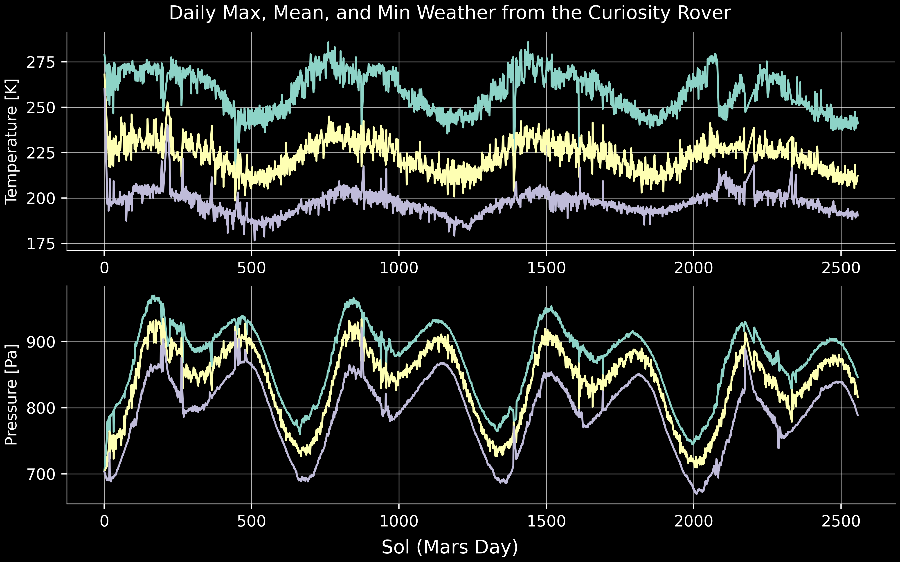

The python scripts in this repository download and plot data from the [REMS](https://mars.nasa.gov/msl/mission/instruments/environsensors/rems/) sensors on the Curiosity Rover on Mars.

Looking in the `scripts` directory:
* `download_rems.py` uses [beautiful soup](https://www.crummy.com/software/BeautifulSoup/bs4/doc/) and [multiprocessing](https://docs.python.org/3/library/multiprocessing.html) to scrape the Planetary Data System's [repository of REMS data](https://atmos.nmsu.edu/PDS/data/mslrem_1001/DOCUMENT/) and downloads finalized (processed) data into a csv file for each sol of measurements. The data in each column of the target files (like [this](https://atmos.nmsu.edu/PDS/data/mslrem_1001/DATA/SOL_00090_00179/SOL00090/RME_405436167RMD00900000000_______P8.TAB) one) is described in [this](https://atmos.nmsu.edu/PDS/data/mslrem_1001/LABEL/MODRDR6.FMT) file.
* `process_rems.py` reads the csv files created by `download_rems.py` and shuffles the key data into binary files for easier, more efficient storage.
* `plot_rems.py` makes a 2 panel plot of the daily max, mean, and min surface temperature and surface pressure like the one below.

