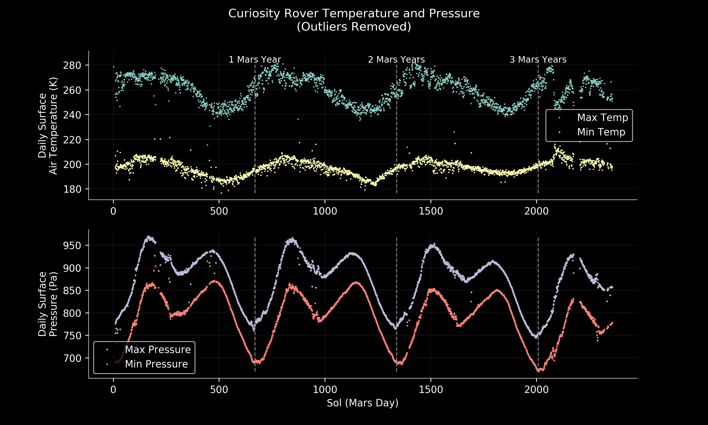

The python scripts in this repository download, process (find daily maxima and minima), and plot data from the [REMS](https://mars.nasa.gov/msl/mission/instruments/environsensors/rems/) sensors on the Curiosity Rover on Mars.

* `download_rems.py` scrapes the Planetary Data System's [repository of REMS data](https://atmos.nmsu.edu/PDS/data/mslrem_1001/DOCUMENT/) and downloads  finalized (processed) data into a csv file for each sol of measurements. The data in each column of the target files (like [this](https://atmos.nmsu.edu/PDS/data/mslrem_1001/DATA/SOL_00090_00179/SOL00090/RME_405436167RMD00900000000_______P8.TAB) one) is described in [this](https://atmos.nmsu.edu/PDS/data/mslrem_1001/LABEL/MODRDR6.FMT) file.
* `process_rems_daily_extremes.py` reads the csv files created by `download_rems.py` and creates a new csv file containing only the minimum and maximum value of selected variables/columns for each sol.
* `plot_rems_daily_extremes.py` makes a 2 panel plot of the daily max and min of the surface temperature and surface pressure like the one below.

All together the scripts can be used as follows:
```
python download_rems.py <data directory> <cpus>
python process_rems_daily_extremes.py <data directory> <processed file name> <cpus>
python plot_rems_daily_extremes.py <processed file name>
```
where `<data directory>` is the folder where all the full-resolution data is downloaded, `<cpus>` is the number of multiprocessing cpus to use, and `<processed file name>` is where the daily min and max information is stored.


