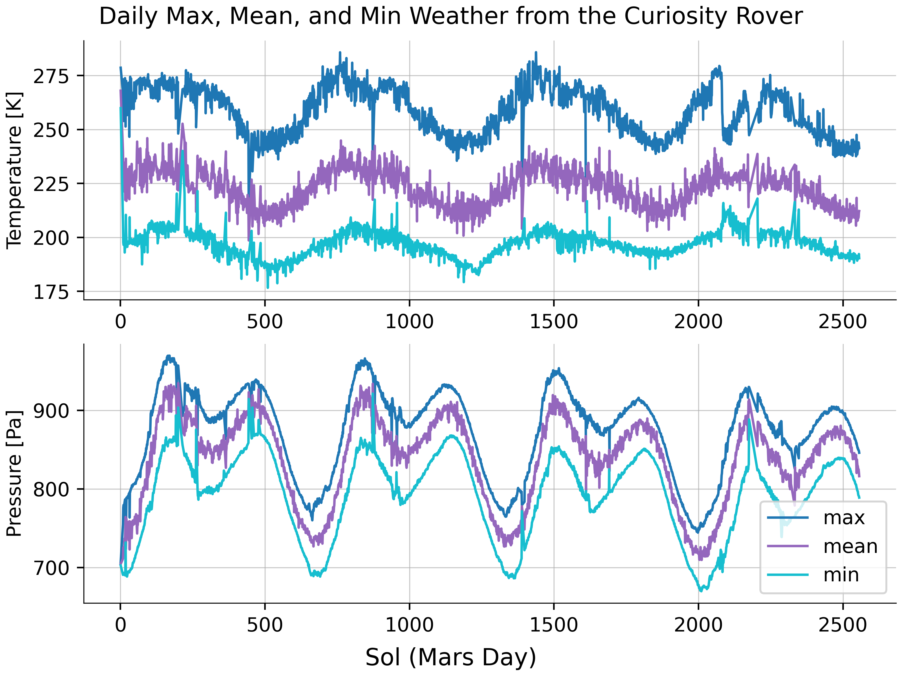

# REMS

The python scripts in this repository download, process, and plot data from the [REMS](https://mars.nasa.gov/msl/mission/instruments/environsensors/rems/) weather sensors onboard the [Curiosity Rover](https://en.wikipedia.org/wiki/Curiosity_(rover)) in Gale Crater, Mars. The rover has been rolling around collecting measurements since August 2012. The data quality is not great, with a fair amount missing or questionable, but it's interesting nevertheless.

-------------------

Looking in the `scripts` directory:
* `download_rems.py` uses [beautiful soup](https://www.crummy.com/software/BeautifulSoup/bs4/doc/) and [multiprocessing](https://docs.python.org/3/library/multiprocessing.html) to scrape the Planetary Data System's [repository of REMS data](https://atmos.nmsu.edu/PDS/data/mslrem_1001/DOCUMENT/) and downloads finalized (processed) data into a csv file for each sol of measurements. The data in each column of the target files (like [this](https://atmos.nmsu.edu/PDS/data/mslrem_1001/DATA/SOL_00090_00179/SOL00090/RME_405436167RMD00900000000_______P8.TAB) one) is described in [this](https://atmos.nmsu.edu/PDS/data/mslrem_1001/LABEL/MODRDR6.FMT) file.
* `process_rems.py` reads the csv files created by `download_rems.py` and writes the data of interest into binary files for more efficient storage and fast read-in.
* `plot_rems.py` makes a couple of plots using the pressure and temperature data from the sensors.

--------------------

REMS cycles!

This plot shows the daily minimum, mean, and maximum values for pressure and temperature over several Mars years. On Mars, the planetary rotation rate and day length is very similar to Earth's, but the planet's orbit is larger, so the Martian year is longer. One Mars year is about 687 sols (Mars days). Gale Crater is about 5 degrees above the equator, so a seasonal temperature cycle is evident. The seasonal pressure cycle, however, is very different from Earth's and is an interesting physical riddle. Can you explain it?

This plot shows the distribution of temperature and pressure.

